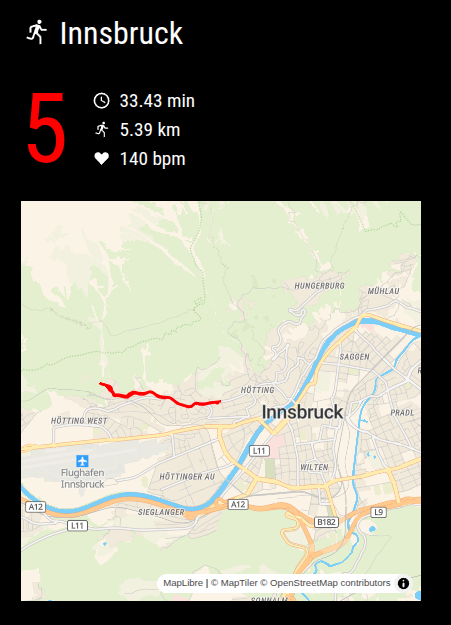

# Magic Mirror² MMM-GConnect

[[English]](./README.md)

Se trata de un módulo [`Magic Mirror²`](https://magicmirror.builders/) que muestra datos de la actividad más reciente registrada
en tu cuenta de Garmin Connect™.

En concreto, muestra los siguientes datos:
- días transcurridos desde tu última actividad deportiva
- distancia total de la última actividad deportiva
- tiempo total de la última actividad deportiva
- frecuencia cardiaca media de la última actividad deportiva

Opcionalmente, también puedes activar un mapa vectorial que muestra el recorrido de la última actividad. El mapa
utiliza la biblioteca de mapas web [MapLibre](https://maplibre.org) y el servicio de mapas [MapTiler](https://www.maptiler.com). Para mostrar un mapa,
debe registrarse en MapTiler y obtener una clave API. La clave API es gratuita para una cantidad fija de uso al mes.


Para utilizar este módulo, necesitas tener una cuenta de [`Garmin Connect™`](https://connect.garmin.com/). Puedes configurar
tu nombre de usuario y contraseña en el archivo `config.js` como se especifica a continuación.

Nota: Este proyecto no está afiliado a la empresa Garmin.

## Captura de pantalla

Este es un ejemplo de cómo se ve Magic Mirror² GConnect en mi configuración:



## Instalación

Clone este repositorio en su carpeta MagicMirror `modules`.

Ejemplo:

```bash
cd /home/pi/MagicMirror/modules
git clone https://github.com/tderflinger/MMM-GConnect.git
```

Instala las dependencias de JavaScript:

```bash
cd /home/pi/MagicMirror/modules/MMM-GConnect
npm i
```

También necesitará establecer el derecho de ejecución del binario tcx-ls o tcx-ls-arm que se encuentra en el directorio `MMM-GConnect` bajo la carpeta `bin`.

```bash
cd /home/pi/MagicMirror/modules/MMM-GConnect/bin
chmod +x ./tcx-ls-arm
```

Este binario sólo es necesario cuando se muestra un mapa. Se utiliza para convertir el archivo TCX descargado de Garmin Connect en un archivo GeoJSON que luego se muestra en el mapa.

Por último, edita tu archivo de configuración en `config/config.js` con la siguiente configuración.

```
{	
  module: "MMM-GConnect",
  position: "top_left",
  config: {
    interval: 60000000,
    loginName: "Your login name",
    password: "Your login password",
    showMap: true,
    mapTilerKey: "Your API key",
  },
},
```

Puede obtener la clave API de MapTiler registrándose en el [sitio web de MapTiler](https://www.maptiler.com) y accediendo a "Claves API" en el menú de la izquierda. Es gratuita para un determinado número de invocaciones al mes.

Tenga en cuenta que en caso de que utilice la función de mapa y tenga mucha actividad, la carpeta `data` dentro de MMM-GConnect podría llenarse con archivos de actividad TCX y GeoJSON descargados. Considere purgar esa carpeta
de vez en cuando.


## Opciones de configuración
| **Opción**        | **Descripción** |
| --- | --- |
| `interval`      | Intervalo entre la nueva obtención de datos de Garmin Connect™ en ms. |
| `loginName`      | Tu nombre de inicio de sesión en Garmin Connect™. |
| `password`      | Tu contraseña para Garmin Connect™ |
| `showMap`      | Booleano, se establece en true para mostrar un mapa de la ruta |
| `mapTilerKey`      | Clave API del servicio de mapas MapTiler. Solo se necesita cuando se desea mostrar un mapa. |

## Se buscan archivos TCX

Con el fin de probar a fondo y hacer la aplicación más robusta, estoy buscando donaciones de archivos TCX.
Por favor, elimine todos los datos privados. El archivo TCX sólo se utiliza para probar la funcionalidad de la aplicación.

¿Está interesado? Póngase en contacto conmigo.

## Pruebas

He probado el módulo `Magic Mirror² GConnect` en una Raspberry Pi 3B con Raspberry OS
y Node 22 y `Magic Mirror²` versión 2.31.0.

## Iconos

El módulo utiliza los siguientes iconos de iconduck.com:

- https://iconduck.com/icons/12253/running International Attribution License
- https://iconduck.com/icons/117847/heart-love-like MIT License
- https://iconduck.com/icons/88028/clock-time-four-outline Apache License

## Referencias

Magic Mirror²: https://magicmirror.builders

JavaScript library garmin-connect: https://github.com/Pythe1337N/garmin-connect

Preact: https://preactjs.com

HTM: https://github.com/developit/htm

Garmin Connect™: https://connect.garmin.com/

MapLibre: https://maplibre.org

MapTiler: https://www.maptiler.com

Tcx-ls: https://github.com/tderflinger/tcx-ls

Gracias al gran trabajo de Pythe1337N en la creación de la librería JavaScript `garmin-connect`.
Sin su trabajo, este módulo no habría sido posible.

## Licencia

Licencia MIT