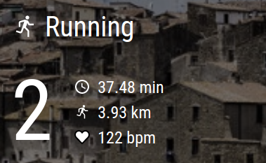

# Magic Mirror² GConnect

This is a [`Magic Mirror²`](https://magicmirror.builders/) module that displays data from the most recent activity loggged
in your Garmin Connect™ account.

Specifically, it displays the following data:
- days since your last sports activity
- total distance of last sports activity
- total time of last sports activity
- average heart rate of last sports activity

In order to use this module, you need to have a [`Garmin Connect™`](https://connect.garmin.com/) account. You can configure
your username and password in the `config.js` file as specified below.

Note: This project is not affiliated with the Garmin company.

## Preview Screenshot

This is an example of how Magic Mirror² GConnect looks in my configuration:



## Installation

Clone this repository into your MagicMirror `modules` folder.

Example:

```
cd /home/pi/MagicMirror/modules
git clone https://github.com/tderflinger/MMM-GConnect.git
```

Install the JavaScript dependencies:

```
cd /home/pi/MagicMirror/modules/MMM-GConnect
npm i
```

Finally, edit your configuration file under `config/config.js` with the following configuration.
```
{	
  module: "MMM-GConnect",
  position: "top_left",
  config: {
    interval: 60000000,
    loginName: "your login name",
    password: "your login password",
  },
},
```

## Config Options
| **Option**        | **Description** |
| --- | --- |
| `interval`      | Interval between new fetch of data from Garmin Connect™ in ms |
| `loginName`      | Your login name to Garmin Connect™ |
| `password`      | Your password to Garmin Connect™ |

## Testing

I have tested the `Magic Mirror² GConnect` module on an Raspberry Pi 3B with Raspberry OS
and Node 16.15.0 and `Magic Mirror²` version 2.19.0.

## Icons

The module uses the following icons from iconduck.com:

- https://iconduck.com/icons/12253/running International Attribution License
- https://iconduck.com/icons/117847/heart-love-like MIT License
- https://iconduck.com/icons/88028/clock-time-four-outline Apache License

## References

Magic Mirror²: https://magicmirror.builders

JavaScript library garmin-connect: https://github.com/Pythe1337N/garmin-connect

Preact: https://preactjs.com

HTM: https://github.com/developit/htm

Garmin Connect™: https://connect.garmin.com/

Thanks to the great work of Pythe1337N in creating the `garmin-connect` JavaScript library.
Without his work, this module would not have been possible.

## License

MIT License