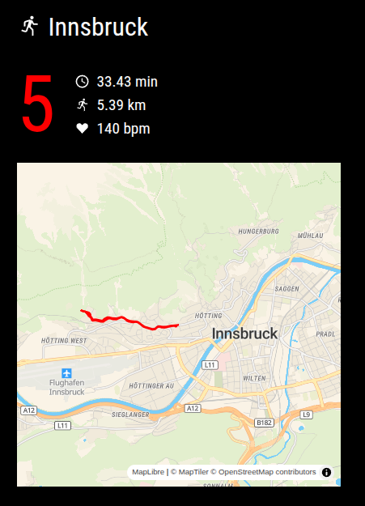

# Magic Mirror² MMM-GConnect

[[Español]](./README-es.md)

This is a [`Magic Mirror²`](https://magicmirror.builders/) module that displays data from the most recent activity loggged
in your Garmin Connect™ account.

Specifically, it displays the following data:
- days since your last sports activity
- total distance of last sports activity
- total time of last sports activity
- average heart rate of last sports activity

Optionally, you can also enable a vector map that shows the route of the last activity. The map
uses the [MapLibre](https://maplibre.org) web map library and the [MapTiler](https://www.maptiler.com) map service. In order to show a map you
must register with MapTiler and obtain an API key. The API key is free for a fixed amount of usage per month.

In order to use this module, you need to have a [`Garmin Connect™`](https://connect.garmin.com/) account. You can configure
your username and password in the `config.js` file as specified below.

Note: This project is not affiliated with the Garmin company.

## Preview Screenshot

This is an example of how Magic Mirror² GConnect looks in my configuration:



## Installation

Clone this repository into your MagicMirror `modules` folder.

Example:

```bash
cd /home/pi/MagicMirror/modules
git clone https://github.com/tderflinger/MMM-GConnect.git
```

Install the JavaScript dependencies:

```bash
cd /home/pi/MagicMirror/modules/MMM-GConnect
npm i
```

You will also need to set execution right of the tcx-ls or tcx-ls-arm binary that is located in the `MMM-GConnect` directory under the `bin` folder.

```bash
cd /home/pi/MagicMirror/modules/MMM-GConnect/bin
chmod +x ./tcx-ls-arm
```

This binary is only needed when showing a map. It is used for converting the TCX file downloaded from Garmin Connect to a GeoJSON file that is then displayed on the map.

Finally, edit your configuration file under `config/config.js` with the following configuration.
```
{	
  module: "MMM-GConnect",
  position: "top_left",
  config: {
    interval: 60000000,
    loginName: "Your login name",
    password: "Your login password",
    showMap: true,
    mapTilerKey: "Your API key",
  },
},
```

You can get the MapTiler API key by registering on the [MapTiler website](https://www.maptiler.com) and going to "API Keys" on the left menu. It is free for a certain amount of invocations per month.

Note that in case you use the map feature and have a lot of activity, the `data` folder within MMM-GConnect might fill up with downloaded TCX and GeoJSON activity files. Consider purging that
folder from time to time.

## Config Options
| **Option**        | **Description** |
| --- | --- |
| `interval`      | Interval between new fetch of data from Garmin Connect™ in ms |
| `loginName`      | Your login name to Garmin Connect™ |
| `password`      | Your password to Garmin Connect™ |
| `showMap`      | Boolean, set to true to show a map of the route |
| `mapTilerKey`      | API key of the MapTiler map service. Only needed when you want to show a map. |

## TCX Files Wanted

In order to thoroughly test and make the application more robust, I am looking for TCX file donations.
Please remove all private data. The TCX file is only used to test the functionality of the application.

Are you interested? Please contact me.

## Testing

I have tested the `Magic Mirror² GConnect` module on an Raspberry Pi 3B with Raspberry OS
and Node 22 and `Magic Mirror²` version 2.31.0.

## Icons

The module uses the following icons from iconduck.com:

- https://iconduck.com/icons/12253/running International Attribution License
- https://iconduck.com/icons/117847/heart-love-like MIT License
- https://iconduck.com/icons/88028/clock-time-four-outline Apache License

## References

Magic Mirror²: https://magicmirror.builders

JavaScript library garmin-connect: https://github.com/Pythe1337N/garmin-connect

Preact: https://preactjs.com

HTM: https://github.com/developit/htm

Garmin Connect™: https://connect.garmin.com/

MapLibre: https://maplibre.org

MapTiler: https://www.maptiler.com

Tcx-ls: https://github.com/tderflinger/tcx-ls

Thanks to the great work of Pythe1337N in creating the `garmin-connect` JavaScript library.
Without his work, this module would not have been possible.

## License

MIT License